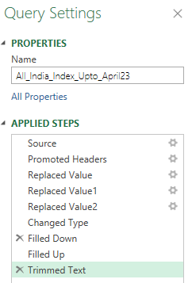
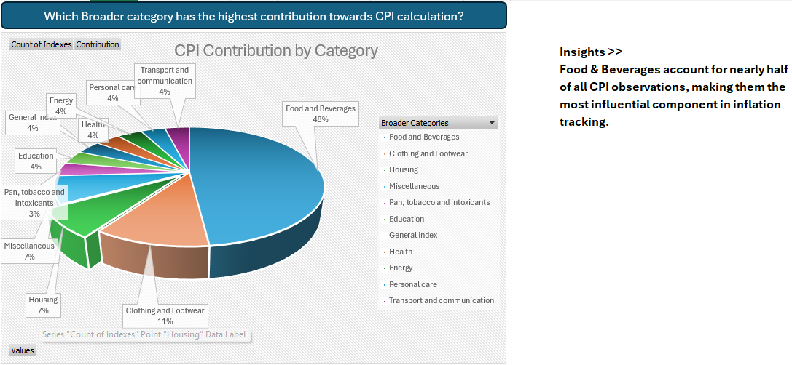
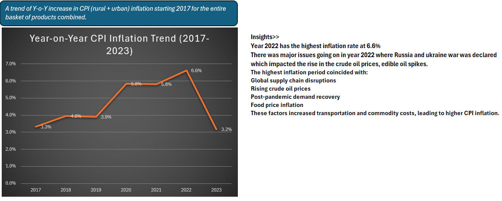
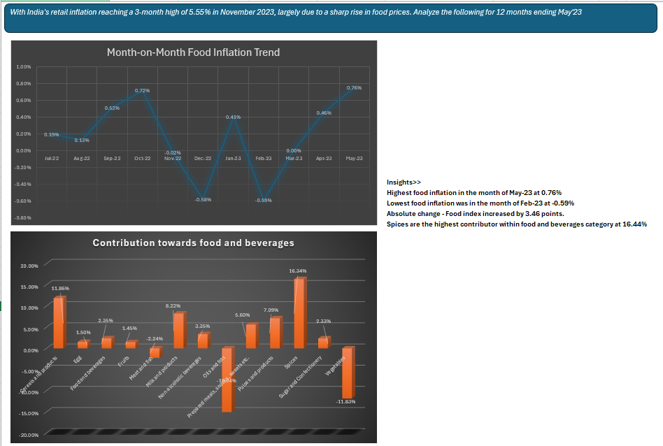
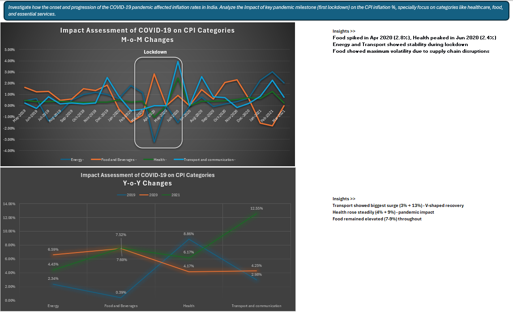
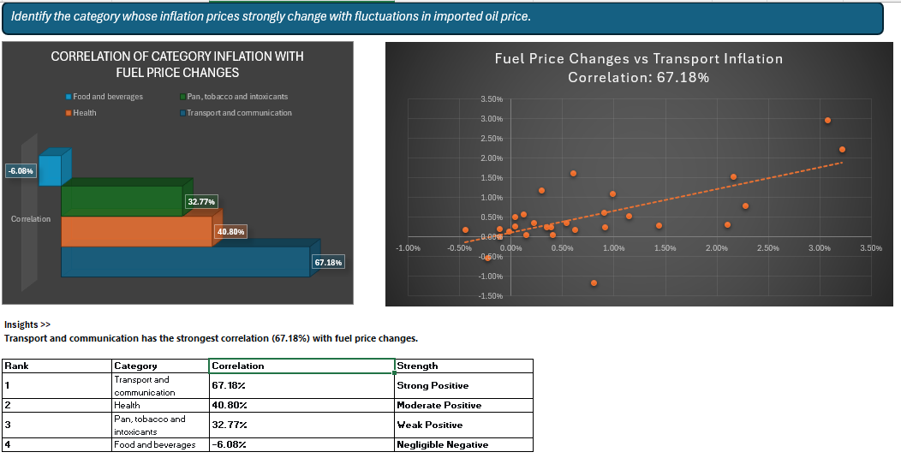

# CPI Inflation Analysis (2013–2023)

Analysis of India's Consumer Price Index (CPI) from 2013 to 2023, built in Excel and Power Query as part of my Data Analytics learning journey. I wanted a dataset that would force me to deal with real messiness — missing values, inconsistent labels, wide-format data — before getting to the actual analysis, and CPI data fit the bill.

The goal was to answer five business questions: which categories drive the CPI basket, how inflation trended year-on-year, what pushed food inflation up, how COVID-19 affected different categories, and how closely category inflation tracks imported oil prices.

---

## Dataset

| Attribute | Details |
|---|---|
| Source | Government of India CPI Data |
| Period | 2013–2023 |
| Coverage | Rural, Urban, Rural + Urban |
| Categories | 27 CPI categories |
| Tools | Excel, Power Query |

Source link: `Dataset_Source/Source_Link.txt`

---

## Data Cleaning & Transformation

The raw data needed a fair amount of work before it was usable:

- Replaced "NA" text with proper nulls, converted category fields to numeric
- Filled missing values (Fill Down / Fill Up), fixed missing Housing values
- Corrected month-name inconsistencies and trimmed extra spaces from text fields
- Added a Month Number column for chronological sorting
- Unpivoted the data from wide to long format and mapped categories into broader buckets
- Built out date fields to support trend analysis



The final structure — Sector, Year, Month, Categories, Indexes, Broader Categories, Month Number, Date — made Pivot Table reporting straightforward.

---

## Findings

**1. Category Contribution** — Food & Beverages make up ~48% of the CPI basket, by far the largest single contributor.


**2. Year-on-Year Trend** — 2022 had the highest inflation of the period, driven by rising crude oil prices, supply chain disruptions, post-pandemic demand recovery, and the Russia-Ukraine conflict.


**3. Food Inflation** — Peaked in May 2023 and bottomed out in February 2023; spices were the largest single contributor within the food basket.


**4. COVID-19 Impact** — Food, Health, and Transport saw the sharpest fluctuations after the March 2020 lockdown.


**5. Oil Price Correlation** — Transport & Communication had the strongest positive correlation with fuel price changes of any category.


---

## Skills Demonstrated

Pivot Tables, Pivot Charts, advanced formulas, data modeling, Power Query (cleaning, transformation, unpivoting), trend analysis, correlation analysis, and business insight generation.

---

## Project Files

```text
cpi-inflation-analysis-excel
│
├── Dataset_Source
├── Excel_Workbook
├── Project_Report
├── Screenshots
└── README.md
```

- Excel Workbook: `Excel_Workbook/CPI Inflation Project.xlsx`
- Project Report: `Project_Report/CPI_Inflation_Portfolio_Report_V2.pdf`

---

## Author

Arvind Kumar
Data Analytics Enthusiast | Excel | Power Query | Power BI (learning)
